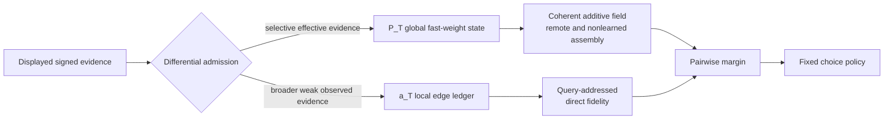

# Liu Mainline v1 presentation package

## Reporting position

The current result should be presented as a completed model-level mechanism
story with explicit validity boundaries—not as a perfect fit to every Liu
statistic and not as a human-neural mechanism claim.

One-sentence conclusion:

> A meta-learned plastic recurrent network converts sparse, partially encoded
> relational evidence into coherent yet individualized rankings through a
> transported division between `P_T` global construction and `a_T`
> query-addressed direct fidelity.

The frozen baseline is commit
`7bfb896bfee97353d6d745798b28e96b6614408c`. The evidence manifest is
`benchmarks/liu_mainline_evidence_manifest_v1.json`; the reporting freeze is
`benchmarks/liu_mainline_freeze_v1.json`.

## Recommended 12-slide structure

### 1. Scientific question

**Headline:** How can identical sparse relational evidence yield coherent but
individualized global structures while preserving direct experience?

Show the Liu information boundary: passive signed support evidence, all-pair
queries, and no support choice or test feedback. State that behavioral
reproduction is the entry gate, while the target is an explanatory algorithm.

Do not introduce human-neural implementation at this point.

### 2. Behavioral target and reproduction map

**Headline:** The frozen model reproduces the major phenotype, with three
quantitative mismatches retained.

Show the nine-row table from `docs/model_behavior_reproduction_map_v1.md`:
six phenomena reproduced; distance slope, endpoint contrast, and one network's
inconsistency prevalence are qualitatively correct but quantitatively
mismatched.

Speaker line: “The model is competent enough for mechanism analysis, but the
three mismatches remain constraints rather than tuning targets.”

### 3. Why one global channel was insufficient

**Headline:** A near-additive global field supports inference but does not
preserve all direct relation-specific fidelity.

Show the supported sequence from fast-weight necessity through near-additive
Hodge geometry and expected-rank-over-MAP projection. Then show the negative
local-expression chain: unsigned gate failed, signed scalar gate failed, and a
low-capacity first-order residual was informative but insufficient.

This slide motivates a separate persistent local computation without claiming
that every failed candidate was useless.

### 4. Working mechanism

**Headline:** Different evidence-admission rules feed two causally distinct
computations.

Use this diagram:



Use `a_T` consistently for the presentation-level local ledger; explain once
that some historical documents call the same local state `L_T`.

### 5. Causal double dissociation

**Headline:** Global inference and direct fidelity can be selectively removed.

Show:

```text
P off, a on -> direct learned information persists;
               nonlearned inference and remote reassembly collapse

P on, a off -> global v1 computation is restored exactly;
               the local direct-fidelity benefit disappears
```

Report that v2.3 replicated on seeds 2102/2103 and differential access received
fresh-backbone confirmation on 2104/2105. Participants were never pooled
across networks.

### 6. Exact local algorithm

**Headline:** The local state is an exactly compressible addressed edge ledger.

Show

\[
a_{t+1}=a_t+s_t^L k_t,
\qquad
\ell_q=a_T\cdot k_q.
\]

State the strongest exactness result: item-count transport retained maximum
tensor-state error `6.66e-16` and all-query raw-read error `8.88e-15`.

Boundary: this supports the functional algorithm, not unique tensor-product
coding or distinct biological memory stores.

### 7. Topology and presentation-order transport

**Headline:** The mechanism is not a lookup table for one graph or one support
schedule.

Show two compact blocks:

- topology: three prospectively matched alternative N=8 graphs, 9/9 cells
  pass;
- presentation order: blockwise random, relation-clustered, and reverse, 9/9
  cells pass.

Mention that `a_T` is exactly order invariant, whereas the nonlinear recurrent
`P_T` field changes quantitatively while retaining its function.

### 8. Sparsity supplies the main validity boundary

**Headline:** The causal division survives density changes, while
individualized phenotype progressively regularizes.

Show:

- 23/24 complete cells and 191/192 primary-link decisions pass;
- all competence, global-causal, local-causal, and exact links pass in all 24;
- the sole miss is the frozen binary stable-error prevalence bound in balanced
  E=10 seed 2103;
- all six paired analyses show increasing inter-subject order tau with density;
  stable-error incidence decreases directionally in all six but significantly
  in only one.

Keep the formal parent outcome
`SPARSITY_DEPENDENT_OR_UNRESOLVED`. Do not relabel it as a pass during the talk.

### 9. Item-count transport

**Headline:** The organization transports outside the N=8 training
cardinality.

Show N=6/8/10 × seeds 2101–2103: 9/9 cells and 72/72 primary links pass. Add a
small table:

| N | Learned exact | Nonlearned exact | Hodge-order tau |
|---:|---:|---:|---:|
| 6 | .905–.922 | .825–.833 | .713–.733 |
| 8 | .945 | .809–.824 | .706–.723 |
| 10 | .930–.936 | .749–.759 | .585–.608 |

State explicitly that N=6/10 are strict OOD tests of N=8-trained backbones.

### 10. Positive transport and quantitative degradation coexist

**Headline:** A stable algorithmic organization is not scale-invariant global
performance.

Across N=6→10, show the linked fingerprint:

- nonlearned accuracy decreases;
- Hodge-order alignment decreases;
- per-pair remote magnitude decreases;
- normalized distance slope increases;
- Hodge fraction remains near one.

Interpretation: the global field remains additive and causally necessary, but
its correct confidence/allocation quality changes with cardinality. Do not call
this a failed item-count mechanism test.

### 11. Final supported claim and exclusions

**Headline:** Liu Mainline v1 is closed at a model-level, one-factor transport
boundary.

Supported:

- differential evidence admission;
- `P_T` global coherent/remote construction;
- `a_T` query-addressed direct fidelity;
- transport across registered topology, order, density, and item-count tests.

Not supported:

- perfect reproduction of every human statistic;
- full topology × order × density × size factorial generality;
- arbitrary size scaling or network-population prevalence;
- unique code, biological memory stores, or human neural implementation.

### 12. Stop point and future programs

**Headline:** Freeze this result; new work starts from a new question.

For the current reporting phase, no new model experiment is required. Park
list linking, classic TI, Miconi ancestry, human experiments, MEG, compression,
and parameter tuning.

If a later model program is opened, the most natural question is why the
`P_T/a_T` organization transports while global policy is cardinality-sensitive.
That future read-only decomposition is not part of Liu Mainline v1.

## Short versions

For a 10-minute report, use slides 1, 2, 4, 5, 7–11. For a 20-minute report,
use all 12 slides. Move the failed gate/residual route on slide 3 and exact
formulae on slide 6 to backup if the audience is primarily behavioral.

## Anticipated questions

### “Did the model reproduce Liu completely?”

No. Six of nine frozen phenomena are quantitatively reproduced; three retain
specific quantitative mismatches. The completed contribution is a causal and
transported model-level explanation with explicit negative boundaries.

### “Why is sparsity called unresolved if almost everything passes?”

The registered outcome was a conjunction. One E=10 cell missed the frozen
individualized stable-error interval, so the parent result stays unresolved.
The subsequent registered localization shows replicated order convergence,
not permission to change the original endpoint.

### “Does N=10 prove arbitrary scaling?”

No. It is one strict OOD cardinality point in a matched cycle family. It shows
mechanism transport across the registered N=6–10 range while also exposing
systematic global-policy degradation.

### “Are `P_T` and `a_T` two biological memory systems?”

No. They are causally distinct computations in this model. Biological
separation and human implementation remain untested.

### “Why not fix the remaining mismatches now?”

The mismatches have different directions and mechanisms. Post-hoc tuning would
weaken the frozen evidence. Any future repair must begin as a separate,
prospectively registered scientific question.

## Source map for figures and tables

| Presentation content | Frozen source |
|---|---|
| Nine-phenomenon behavior table | `docs/model_behavior_reproduction_map_v1.md` |
| Full mechanism and causal links | `docs/model_mechanism_synthesis_v1.md` |
| v2.3 double dissociation | `docs/conjunctive_local_trace_replication_v2_3.md` |
| v2.4 differential admission | `docs/dual_evidence_access_confirmation_v2_4.md` |
| Topology transport | `docs/liu_support_topology_transport_v1.md` |
| Presentation-order transport | `docs/liu_presentation_order_transport_v1.md` |
| Sparsity and its localization | `docs/liu_evidence_sparsity_transport_v1.md`; `docs/liu_sparsity_individualization_localization_v1.md` |
| Item-count transport | `docs/liu_item_count_transport_v1.md` |
| Integrated hashes and outcomes | `benchmarks/liu_mainline_evidence_manifest_v1.json` |

All reported numbers should be copied from these frozen sources. Presentation
figures may reorganize them visually but must not introduce new selections,
pooled intervals, or unstated across-seed inferential claims.
