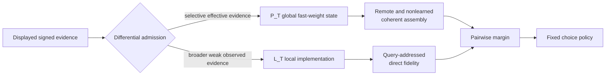

# Liu Mainline v1 presentation package v2

## Reporting position

Present Liu v1 as a completed model-level causal and transport result with
explicit quantitative and validity boundaries. Do not present it as a perfect
fit to every human statistic or as an identified human-neural mechanism.

One-sentence conclusion:

> A meta-learned plastic recurrent network transforms sparse, partially
> encoded signed evidence into coherent yet individualized Liu-style rankings
> through a transported functional division: selective global admission feeds
> `P_T` for remote/nonlearned assembly, while broader weak local admission feeds
> `L_T`, equivalently summarized by edge-ledger coordinate `a_T`, for
> query-addressed direct fidelity.

The evidence object is `mainlines/liu_v1/manifest.json`; presentation order is
defined separately in `mainlines/liu_v1/report_view.json`.

## Four-figure main story

### Figure 1 — Human target and behavioral competence

Headline:

> Identical sparse evidence yields stable, coherent, yet individualized
> rankings; the model reproduces the major phenotype while retaining three
> quantitative mismatches.

Show the Liu information boundary before model architecture:

- eight fixed items and eight signed support relations;
- four passive presentations per relation;
- all 28 pairs tested;
- no learning response and no test feedback;
- displayed magnitude is task information; random absolute height is nuisance.

Then show the frozen nine-phenomenon map: six rows reproduced and three
qualitatively reproduced but quantitatively mismatched. The retained mismatches
are excessive symbolic-distance slope, weak serial-position endpoint contrast,
and seed-2104 self-inconsistency calibration.

Speaker line: “Behavioral competence licenses mechanism analysis; it is not the
scientific endpoint and it is not a claim that the model is the human brain.”

### Figure 2 — Final mechanism and causal double dissociation

Headline:

> Different evidence-admission rules feed two causally distinct computations.

Use the central diagram:



Show the causal contrast in words:

```text
P off, L on -> direct learned information persists;
               nonlearned inference and remote reassembly collapse

P on, L off -> the global v1 computation is restored exactly;
               the local direct-fidelity benefit disappears
```

Report both evidence levels:

- v2.3 four-link replication on independent backbones 2102/2103;
- unchanged v2.4 differential-access confirmation on fresh backbones 2104/2105.

Participants were bootstrapped within network and never pooled across networks.
Keep the small reproducible retained exact-probability cost visible; it remains
within the frozen noninferiority margin and is attributed to cross-talk from
newly admitted omitted writes, not erased as noise.

### Figure 3 — Algorithmic asymmetry

Headline:

> The local computation is exactly reducible; the tested global learning-state
> reductions are not.

#### Actual implementation and exact coordinate

The frozen local implementation is

\[
L_{t+1}=L_t+s_t^L k_{r_t},
\qquad
\ell_q=k_q^\top L_T.
\]

Define the cumulative coefficient of each support relation by

\[
a_{t+1}=a_t+s_t^L e_{r_t}.
\]

Then

\[
L_T=\sum_r a_{T,r}k_r,
\]

and therefore

\[
\ell_q
=k_q^\top L_T
=\sum_r k_q^\top k_r\,a_{T,r}
=(K a_T)_q,
\qquad
K_{qr}=k_q^\top k_r.
\]

Use this exact terminology throughout:

> `L_T` is the local tensor/vector implementation in the frozen network;
> `a_T` is its exactly equivalent edge-ledger coordinate used for algorithmic
> exposition.

Main text should use `a_T` when describing the reduced local algorithm.
Implementation and provenance panels may show `L_T`. They are not two competing
models or two memory stores.

#### Global boundary

The terminal global margin is nearly additive,

\[
m_{ij}^{G}(P_T)\simeq s_i-s_j,
\]

but the registered potential-only, scalar-history, and item-history reductions
all fail their prospective closure rules. The correct headline is:

\[
\boxed{\text{simple output geometry}\not\Rightarrow
\text{simple learning dynamics}.}
\]

Do not convert any failed reduction into evidence that `P_T` is irreducible in
principle. The next admissible reduction family, if reopened, must be derived
from `P_T` itself under a new prospective contract.

### Figure 4 — Transport and validity boundary

Headline:

> The functional organization transports across registered one-factor
> variations, while quantitative performance and individualization remain
> condition-sensitive.

Present a single matrix:

| Axis | Frozen outcome | Main boundary |
|---|---|---|
| Support topology | `LIU_STRUCTURAL_MECHANISM_TRANSPORTED` | Three matched N=8 alternatives, not arbitrary graphs |
| Presentation order | `LIU_PRESENTATION_ORDER_MECHANISM_TRANSPORTED` | Three schedules; nonlinear `P_T` fields change quantitatively |
| Evidence sparsity | `SPARSITY_DEPENDENT_OR_UNRESOLVED` | E=10 seed 2103 misses one frozen individualized-stability endpoint |
| Sparsity localization | `ORDER_CONVERGENCE_WITHOUT_REPLICATED_STABLE_ERROR_LOSS` | Whole orders converge; binary stable-error loss does not replicate |
| Item count | `LIU_ITEM_COUNT_MECHANISM_TRANSPORTED` | N=6/10 are strict OOD points, not arbitrary scaling |

State explicitly that transport is sequential and one-factor. There is no
topology × order × density × item-count factorial claim.

## Recommended report sequence

The four figures can be expanded into ten slides:

1. Scientific question and Liu information boundary.
2. Human phenotype and frozen behavioral map.
3. Why a global-only channel was insufficient: preserve positive global facts,
   then show the gate/residual families as route-changing negatives.
4. Differential evidence admission and the `P_T/L_T` mechanism.
5. Causal double dissociation and independent-backbone confirmation.
6. Exact `L_T <-> a_T` local algorithm.
7. Global reduced-dynamics boundary.
8. Topology/order transport.
9. Sparsity/item-count transport and quantitative degradation.
10. Supported claim, exclusions, reproduction contract, and stop point.

Research chronology belongs in backup. It explains why candidates were
proposed, but failed gates are not logical prerequisites of the confirmed local
trace.

## Final supported claim

Supported at the frozen model-level boundary:

- task-faithful signed metric evidence;
- behavioral competence on the major Liu phenotype;
- `P_T`-dependent coherent remote/nonlearned assembly;
- query-addressed direct fidelity from broader weak evidence in `L_T/a_T`;
- causal double dissociation and evidence/query specificity;
- exact local edge-ledger reduction;
- one-factor transport across registered topology, order, density, and N=6/8/10
  item-count tests.

Not supported:

- perfect quantitative reproduction of all Liu phenomena;
- a full factorial or arbitrary graph/schedule/density/size guarantee;
- network-population prevalence;
- a unique tensor-product code or two biological stores;
- human-neural implementation;
- exact Bayesian sequential updating;
- a sufficient low-capacity reduction of global learning dynamics.

## Reference boundaries

- Liu task fidelity is the only experimental fact foundation of this mainline.
- Miconi and Kay provide model ancestry for meta-learned episode-level learning,
  but their rewarded adjacent-pair task is not Liu evidence.
- Lippl et al. provide theoretical context for classic TI geometry and
  norm-based arguments, not a dependency of the Liu causal facts.
- Nelli et al. provide knowledge-reassembly and future list-linking context, not
  evidence for this frozen task program.

## Anticipated questions

### “Are `L_T` and `a_T` different local modules?”

No. `L_T` is the implemented state and `a_T` is an exact coordinate ledger for
the same state. Their equivalence follows from the fixed relation keys and the
linear query read shown above.

### “Did the model reproduce Liu completely?”

No. Six of nine registered phenomena are quantitatively reproduced. Three are
qualitatively correct but quantitatively mismatched and remain frozen
constraints.

### “Why call sparsity unresolved when almost every causal link passes?”

The parent rule was a conjunction. One E=10 individualized-stability interval
missed its frozen threshold. Later localization explains the boundary but does
not change the original outcome.

### “Does N=10 establish size generalization?”

It establishes mechanism transport at one strict OOD cardinality in the
registered N=6/8/10 cycle family. It does not establish arbitrary scaling; in
fact global quantitative quality degrades with N.

### “Why not tune the remaining mismatches?”

The result is now a reporting object. Any new repair is a separately registered
program and cannot rewrite Liu v1.

## Figure and table provenance

The committed assets under `docs/assets/liu_mainline_v1/` are generated by:

```bash
direnv exec . python -m fsrl.liu_mainline summarize \
  --output-dir docs/assets/liu_mainline_v1
```

Every displayed metric is registered in `mainlines/liu_v1/report_view.json` and
retains its source file, source SHA-256, and exact JSON pointer. Generation does
not load checkpoints, import a Torch evaluator, resample participants, rerun a
bootstrap, or introduce a new estimand.
