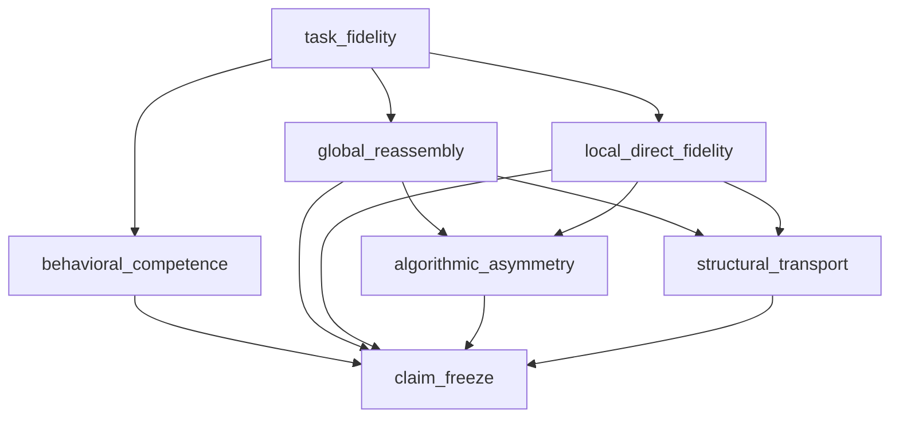

# Liu Mainline v1

This directory is an append-only evidence overlay. It describes which historical
results jointly support Liu v1; it is not a new experiment implementation and
does not replace any frozen runner, contract, lock, result, or report.

Three objects remain distinct:

```text
historical experiment != mainline orchestration != presentation
```

Likewise, `motivated_by` records why a hypothesis was proposed, while
`depends_on` records whether a claim can stand in its current form without its
parents. Research history is therefore not silently converted into a logical
evidence chain.

## Claim DAG



`report_view.json` defines a readable report order independently of this DAG.
Miconi and Kay, Lippl et al., and Nelli et al. are research or theoretical
context; none is inserted into the Liu task-fidelity dependency graph.

## Files

- `manifest.json` contains the claim DAG, evidence registry, historical
  execution commits, execution/canonical locks, semantic replay assertions,
  research lineage, and implementation lineage.
- `artifacts.json` binds 27 formerly machine-local files by content hash to one
  repository bundle. Artifact identity is the member SHA-256, not its former
  `output/` pathname.
- `environment.json` is descriptive provenance. `requirements-lock.txt` is the
  reconstructable Python/CUDA dependency contract.
- `report_view.json` maps each report metric to a frozen source file and exact
  JSON pointer. It defines presentation, not claim dependency.
- `artifacts/<sha256>.tar.zst` is the current small repository-backed storage
  backend. A future `release_asset` or LFS backend may change storage without
  changing member identities or scientific semantics.

## Reproduction philosophy

Historical source verification is commit-aware:

```text
locked SHA-256 == SHA-256(path blob at execution_commit)
```

It never requires the current working-tree copy of a shared runtime to equal a
historical lock. This is not an exemption: a wrong commit, path, source set, or
hash fails closed.

Replay is different. It creates or reuses a detached worktree under
`/tmp/fsrl-mainline/worktrees/<execution_commit>`, restores only the registered
bundle members required by the selected stage, and runs the registered argv in
that worktree. The current `dev` worktree is never switched or stashed.

Two replay contracts are recorded separately:

- Exact replay requires byte-identical output under the frozen execution
  commit, artifacts, dependency/runtime family, and deterministic runner.
- Semantic replay evaluates only prospectively recorded assertions when a GPU,
  driver, operating system, or framework build differs. A replay result may not
  be used to choose a new tolerance.

Both outcomes are always reported. A detached replay can be `semantic_only`
even on the original host when a historical result serialized absolute paths or
when a GPU reduction differs in its final floating-point bits. The overlay does
not strip those fields, canonicalize the result, or add a tolerance to
manufacture byte identity.

`summarize` is deliberately weaker and safer:

```text
summary = f(frozen JSON fields only)
```

It does not load checkpoints, import a model evaluator, execute Torch, resample
participants, rerun bootstrap analyses, modify thresholds, or create a new
scientific estimand. Each table cell and figure metric retains its source path,
source SHA-256, and JSON pointer.

## Commands

```bash
direnv exec . python -m fsrl.liu_mainline status
direnv exec . python -m fsrl.liu_mainline verify
direnv exec . python -m fsrl.liu_mainline doctor
direnv exec . python -m fsrl.liu_mainline summarize --output-dir /tmp/liu-summary
direnv exec . python -m fsrl.liu_mainline replay --stage behavioral_competence
```

There is intentionally no `replay --all`. Execution commits, artifact
requirements, GPU costs, and scientific roles differ by stage; selecting a
stage is a safety property.

## Lifecycle

The overlay moves once from `draft` to `frozen` after clean-clone verification,
CPU validation, at least one GPU fixed-artifact replay, a clean worktree, and a
pushed `dev` candidate. The annotated `liu-mainline-v1` tag then freezes the
manifest, report view, artifact registry and bundle, environment contract, and
generated figure data together.

After that tag:

- a factual correction is an append-only `liu_v1_errata_NNN.json`;
- a changed scientific claim, estimand, threshold, model output, or evidence
  selection is `mainlines/liu_v2/`;
- the v1 files are never silently regenerated or replaced.
