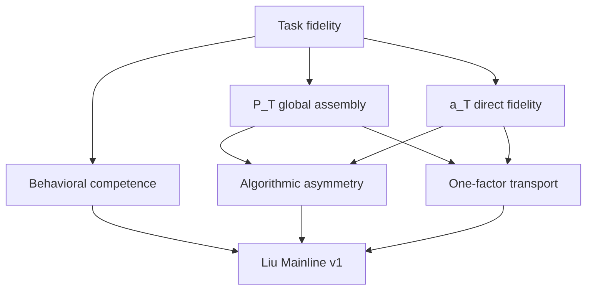

# Liu research guide

> [!NOTE]
> This page is generated from `research/liu/catalog.json`. Edit the
> catalog, then run `direnv exec . python -m fsrl.liu_catalog build`.
> Historical files remain canonical at their original paths.

This is the human-facing companion to the frozen machine-readable Liu
mainline. It organizes the same evidence by scientific question, finding,
negative constraint, and reading purpose. It does not create a second copy
of the evidence or change any registered outcome.

```text
canonical historical files -> frozen Liu Mainline v1 -> human catalog views
```



## Start here

- Frozen evidence object: [mainlines/liu_v1/README.md](../../mainlines/liu_v1/README.md)
- Current presentation package: [docs/liu_presentation_package_v2.md](../../docs/liu_presentation_package_v2.md)
- Physical study capsules: [studies/](studies/)
- Complete one-page ledger: [STUDY_LEDGER.md](STUDY_LEDGER.md)
- Report library: [docs/INDEX.md](../../docs/INDEX.md)
- Contract and lock library: [benchmarks/INDEX.md](../../benchmarks/INDEX.md)
- Result library: [results/INDEX.md](../../results/INDEX.md)

## Reading routes

### Reporting mainline

The shortest route for a talk or manuscript: task, competence, final causal mechanism, algorithmic asymmetry, and transport boundary.

1. [Liu task and human benchmark contract](studies/task_fidelity/README.md) — `frozen_contract` — The task contract preserves item identity, signed displayed magnitude, passive four-presentation learning, all-pair testing, and no test feedback.
2. [Frozen v2.4 behavioral reproduction map](studies/behavior_reproduction_map/README.md) — `supporting` — Six of nine registered phenomena are reproduced and three are qualitatively reproduced but quantitatively mismatched; none is absent.
3. [Formal mechanism confirmation](studies/mechanism_confirmation/README.md) — `mixed` — Six of seven primary mechanism links confirm, including global reassembly, direction transfer, sensitivity placement, history effects, and expected-rank-over-MAP projection; the DA direction-preservation threshold fails through seed-2009 heterogeneity.
4. [Fresh-backbone differential-access confirmation](studies/dual_evidence_access_confirmation/README.md) — `confirmed` — All four links confirm independently on seeds 2104 and 2105, promoting P_T/a_T with differential evidence admission to the working model mechanism.
5. [Asymmetric algorithmic organization synthesis](studies/asymmetric_algorithmic_organization/README.md) — `confirmed` — The local L_T state has an exact edge-ledger-plus-Gram reduction a_T, while the global output is geometrically near-additive but its tested learning states do not close.
6. [Support-topology transport](studies/support_topology_transport/README.md) — `transported` — The registered structural mechanism transports under the repaired, source-locked topology contract.
7. [Presentation-order transport](studies/presentation_order_transport/README.md) — `transported` — All registered links transport across random, clustered, and reversed schedules; the local ledger is exactly commutative while P_T remains quantitatively order-sensitive.
8. [Evidence-sparsity transport](studies/evidence_sparsity_transport/README.md) — `unresolved` — All causal components transport through E=9 and nearly all at E=10, but one stable-error prevalence gate fails; the prediction that denser evidence reduces P_T reliance is rejected.
9. [Item-count transport](studies/item_count_transport/README.md) — `transported` — All primary links pass at N=6, 8, and 10 across all three development backbones, including exact local ledger reconstruction and P/a double dissociation.
10. [Liu Mainline v1 frozen evidence overlay](studies/liu_mainline_v1/README.md) — `frozen_mainline` — A frozen claim DAG, artifact bundle, replay contract, and four-figure report view bind the reportable evidence without replacing historical experiments.

### Diagnostic lineage

How the project moved from a competent global-only model to the P_T/a_T mechanism while preserving valid negative results.

1. [Pilot and formal behavioral confirmation](studies/formal_behavioral_confirmation/README.md) — `mixed` — All ten formal networks remained competent and preserved major causal and geometric positives, but every network failed the full behavioral conjunction with a shared excessive-distance-slope and learned-accuracy fingerprint.
2. [Assembly slope and Hodge diagnostics](studies/assembly_diagnostics/README.md) — `supporting` — The slope mismatch localizes to the neural policy transformation: neural fields are almost additive while human choices retain a stronger learned-pair residual.
3. [Prefix and relation-LOO assembly trajectory](studies/assembly_trajectory/README.md) — `supporting` — Retained support trials immediately affect remote pairs, leave relation-specific LOO signatures, and converge toward an expected-rank-like terminal potential rather than a hard MAP order.
4. [Support-write localization](studies/support_write_localization/README.md) — `supporting` — Eligibility carries evidence-specific direction, modeled DA has a coarser gain role, and alpha places actual writes in high-gain recurrent directions.
5. [Causal support factor swap](studies/support_factor_swap/README.md) — `confirmed` — Matched eligibility transfers donor relation direction, DA changes downstream magnitude, and actual alpha placement beats norm-matched permutation controls.
6. [History state-by-factor closure](studies/history_state_factorial/README.md) — `supporting` — Accumulated P has a reproducible positive effect on local recurrent expression with a smaller positive history-matched interaction; the total factor-generation main effect remains unresolved.
7. [Hidden learned-relation residual audit](studies/hidden_residual_audit/README.md) — `valid_negative` — A small direct-enriched residual exists, but no shared correctness direction is hidden from the current readout; the simplest readout-only route is rejected.
8. [Relation-trace localization](studies/relation_trace_localization/README.md) — `mixed` — Registered static prototype geometry fails in write and terminal matrices, but relation identity appears at the first fast-weight-sensitive query transition and persists after response.
9. [State-by-query operator binding](studies/state_query_operator_binding/README.md) — `confirmed` — State-relation identity and exact query matching replicate in preactivation and nonlinear hidden effects, while query-invariant cross-query identity fails.
10. [Operator-output semantics](studies/operator_output_semantics/README.md) — `supporting` — A and J_b A are correctness-aligned, but exact finite-amplitude tanh degrades the signal and reverses H>A, localizing the missing link to nonlinear expression.
11. [Operator amplitude and curvature path](studies/operator_amplitude_path/README.md) — `supporting` — H>A shows a robust mean zero crossing, F>A crosses in a subset, and correctness-opposed quadratic curvature is relation- and subject-conditioned.
12. [Unsigned curvature gate](studies/curvature_gate/README.md) — `valid_negative` — The gate preserves competence and global mechanism but fails aggregate rescue and specificity, harms the other seven relations, and assigns attenuation in the wrong state direction.
13. [Policy-relative curvature-opposition gate](studies/policy_opposition_gate/README.md) — `valid_negative` — All competence gates pass, but critical H>A/F>A states almost never satisfy the opposition condition and the candidate fails rescue and control specificity.
14. [First-order policy residual](studies/policy_residual/README.md) — `valid_negative` — The natural residual causally moves H>A and F>A toward correctness with state-query specificity, but aggregate rescue and control specificity fail and six correct relations decline.
15. [Conjunctive persistent local-trace pilot](studies/conjunctive_local_trace_pilot/README.md) — `mixed` — The pilot establishes a strong P/L causal double dissociation and direct-enriched local rescue, but its registered sampled learned-accuracy conjunction fails.
16. [Local behavioral non-rescue attribution](studies/local_behavior_attribution/README.md) — `supporting` — Stable-omitted cells dominate learned error mass, retained cells are mostly near ceiling, and the local trace removes retained exact error while sampled accuracy remains endpoint-sensitive.
17. [Independent local-trace mechanism replication](studies/conjunctive_local_trace_replication/README.md) — `confirmed` — All four registered links pass separately on seeds 2102 and 2103 with artifacts jointly locked before Liu evaluation.
18. [Differential evidence-access pilot](studies/dual_evidence_access_pilot/README.md) — `confirmed` — The zero-parameter v2.4 equation rescues omitted direct fidelity with evidence and query specificity while preserving the global/local causal scope.
19. [Fresh-backbone differential-access confirmation](studies/dual_evidence_access_confirmation/README.md) — `confirmed` — All four links confirm independently on seeds 2104 and 2105, promoting P_T/a_T with differential evidence admission to the working model mechanism.

### Closed candidate families

Valid negative routes that should not be reopened without contradictory evidence or a separately frozen scientific question.

1. [Unsigned curvature gate](studies/curvature_gate/README.md) — `valid_negative` — The gate preserves competence and global mechanism but fails aggregate rescue and specificity, harms the other seven relations, and assigns attenuation in the wrong state direction.
2. [Policy-relative curvature-opposition gate](studies/policy_opposition_gate/README.md) — `valid_negative` — All competence gates pass, but critical H>A/F>A states almost never satisfy the opposition condition and the candidate fails rescue and control specificity.
3. [First-order policy residual](studies/policy_residual/README.md) — `valid_negative` — The natural residual causally moves H>A and F>A toward correctness with state-query specificity, but aggregate rescue and control specificity fail and six correct relations decline.
4. [Potential-transition reduction v1](studies/dual_state_reduction_v1/README.md) — `valid_negative` — The registered rank-two potential-transition reduction is insufficient.
5. [Scalar-history reduction v2](studies/dual_state_reduction_v2/README.md) — `valid_negative` — Scalar history is insufficient, while preserving evidence that update amount depends on history.
6. [Item-history reduction v3](studies/dual_state_reduction_v3/README.md) — `valid_negative` — The registered item-history state is insufficient, while exposing relational allocation structure that scalar history misses.
7. [Functional fast-weight latent sufficiency](studies/functional_fast_weight_latent_sufficiency/README.md) — `valid_negative` — The full-P oracle fails held-out generalization and worsens prediction in every backbone; the registered linear sufficiency audit is negative.
8. [Human-only metric constructive comparator](studies/human_metric_constructive_comparator/README.md) — `valid_negative` — The candidate reproduces held-out human distance slope but fails the reliable distance-residualized pair field and cannot become a neural target.

### Preserved unresolved boundaries

Results that constrain the current claim and should remain visible in reporting rather than being averaged away.

1. [Frozen v2.4 behavioral reproduction map](studies/behavior_reproduction_map/README.md) — `supporting` — Six of nine registered phenomena are reproduced and three are qualitatively reproduced but quantitatively mismatched; none is absent.
2. [Global-policy amplitude provenance](studies/global_policy_amplitude_provenance/README.md) — `unresolved` — Neural additive norm is smaller than the posterior comparator even though neural slope is steeper, converting the issue from scalar calibration to field allocation and shape.
3. [Additive-by-residual field reassembly](studies/global_policy_field_reassembly/README.md) — `mixed` — Additive source and norm-matched shape effects are positive, the fixed-sigmoid interaction is negative, and neither component alone closes the comparator.
4. [Equal-energy allocation audit](studies/global_policy_allocation_audit/README.md) — `confirmed` — The exact delta-g to delta-p to per-pair q bridge localizes a replicated, policy-effective allocation fingerprint.
5. [Exact-posterior comparator adequacy](studies/global_policy_comparator_adequacy/README.md) — `valid_negative` — Both registered adequacy criteria fail, so the stable neural-posterior fingerprints remain facts but cannot define a neural intervention target.
6. [Evidence-sparsity transport](studies/evidence_sparsity_transport/README.md) — `unresolved` — All causal components transport through E=9 and nearly all at E=10, but one stable-error prevalence gate fails; the prediction that denser evidence reduces P_T reliance is rejected.
7. [Sparsity individualization localization](studies/sparsity_individualization_localization/README.md) — `supporting` — Subjective orders converge and several error measures decline with density, but binary stable-error incidence loss is not replicated and E=10 family contrasts remain unresolved.
8. [Item-count transport](studies/item_count_transport/README.md) — `transported` — All primary links pass at N=6, 8, and 10 across all three development backbones, including exact local ledger reconstruction and P/a double dissociation.

### Deferred human-validation route

Completed boundary work and prepared acquisition materials that are intentionally outside the current model-only focus.

1. [Exact-posterior comparator adequacy](studies/global_policy_comparator_adequacy/README.md) — `valid_negative` — Both registered adequacy criteria fail, so the stable neural-posterior fingerprints remain facts but cannot define a neural intervention target.
2. [Human-only metric constructive comparator](studies/human_metric_constructive_comparator/README.md) — `valid_negative` — The candidate reproduces held-out human distance slope but fails the reliable distance-residualized pair field and cannot become a neural target.
3. [Magnitude-placement human validation program](studies/magnitude_placement_human_program/README.md) — `deferred` — The protocol, randomization, schema, synthetic validation, and collection-readiness records are preserved for a later human experiment.

## Evidence chapters

### Start here: task and frozen reporting object

Establish the Liu information boundary and the current frozen reporting-level claim map.

- [Liu Mainline v1 frozen evidence overlay](studies/liu_mainline_v1/README.md) — `frozen_mainline`
- [Liu task and human benchmark contract](studies/task_fidelity/README.md) — `frozen_contract`

### Behavioral competence and formal confirmation

Separate what the model reproduces from the behavioral mismatches that remain constraints.

- [Development and qualification record](studies/development_qualification/README.md) — `historical`
- [Pilot and formal behavioral confirmation](studies/formal_behavioral_confirmation/README.md) — `mixed`
- [Frozen v2.4 behavioral reproduction map](studies/behavior_reproduction_map/README.md) — `supporting`

### Global relational assembly

Trace the evidence from additive policy geometry to the state-dependent fast-weight computation P_T.

- [Assembly slope and Hodge diagnostics](studies/assembly_diagnostics/README.md) — `supporting`
- [Prefix and relation-LOO assembly trajectory](studies/assembly_trajectory/README.md) — `supporting`
- [Support-write localization](studies/support_write_localization/README.md) — `supporting`
- [Causal support factor swap](studies/support_factor_swap/README.md) — `confirmed`
- [History state-by-factor closure](studies/history_state_factorial/README.md) — `supporting`
- [Formal mechanism confirmation](studies/mechanism_confirmation/README.md) — `mixed`

### Direct local fidelity

Follow the diagnostic route from failed expression corrections to the replicated local edge state and differential evidence admission.

- [Hidden learned-relation residual audit](studies/hidden_residual_audit/README.md) — `valid_negative`
- [Relation-trace localization](studies/relation_trace_localization/README.md) — `mixed`
- [State-by-query operator binding](studies/state_query_operator_binding/README.md) — `confirmed`
- [Operator-output semantics](studies/operator_output_semantics/README.md) — `supporting`
- [Operator amplitude and curvature path](studies/operator_amplitude_path/README.md) — `supporting`
- [Unsigned curvature gate](studies/curvature_gate/README.md) — `valid_negative`
- [Policy-relative curvature-opposition gate](studies/policy_opposition_gate/README.md) — `valid_negative`
- [First-order policy residual](studies/policy_residual/README.md) — `valid_negative`
- [Conjunctive persistent local-trace pilot](studies/conjunctive_local_trace_pilot/README.md) — `mixed`
- [Local behavioral non-rescue attribution](studies/local_behavior_attribution/README.md) — `supporting`
- [Independent local-trace mechanism replication](studies/conjunctive_local_trace_replication/README.md) — `confirmed`
- [Differential evidence-access pilot](studies/dual_evidence_access_pilot/README.md) — `confirmed`
- [Fresh-backbone differential-access confirmation](studies/dual_evidence_access_confirmation/README.md) — `confirmed`

### Global-policy mismatch and comparator boundary

Localize the excessive distance slope, preserve the replicated field fingerprint, and record why the comparator cannot license a neural intervention.

- [Global-policy slope localization](studies/global_policy_slope_localization/README.md) — `supporting`
- [Global-policy amplitude provenance](studies/global_policy_amplitude_provenance/README.md) — `unresolved`
- [Additive-by-residual field reassembly](studies/global_policy_field_reassembly/README.md) — `mixed`
- [Fresh-backbone field-fingerprint replication](studies/global_policy_field_fingerprint_replication/README.md) — `confirmed`
- [Equal-energy allocation audit](studies/global_policy_allocation_audit/README.md) — `confirmed`
- [Exact-posterior comparator adequacy](studies/global_policy_comparator_adequacy/README.md) — `valid_negative`
- [Human-only metric constructive comparator](studies/human_metric_constructive_comparator/README.md) — `valid_negative`

### Algorithmic compression

Distinguish the exact local edge-ledger reduction from registered global reductions that fail to close the dynamics.

- [Potential-transition reduction v1](studies/dual_state_reduction_v1/README.md) — `valid_negative`
- [Scalar-history reduction v2](studies/dual_state_reduction_v2/README.md) — `valid_negative`
- [Item-history reduction v3](studies/dual_state_reduction_v3/README.md) — `valid_negative`
- [Functional fast-weight latent sufficiency](studies/functional_fast_weight_latent_sufficiency/README.md) — `valid_negative`
- [Asymmetric algorithmic organization synthesis](studies/asymmetric_algorithmic_organization/README.md) — `confirmed`

### One-factor structural transport

Test topology, presentation order, evidence density, and item count without silently upgrading them into arbitrary-domain guarantees.

- [Support-topology transport](studies/support_topology_transport/README.md) — `transported`
- [Presentation-order transport](studies/presentation_order_transport/README.md) — `transported`
- [Evidence-sparsity transport](studies/evidence_sparsity_transport/README.md) — `unresolved`
- [Sparsity individualization localization](studies/sparsity_individualization_localization/README.md) — `supporting`
- [Item-count transport](studies/item_count_transport/README.md) — `transported`

### Human validation work, currently deferred

Preserve the completed comparator boundary and prepared magnitude-placement protocol without mixing them into the current model program.

- [Magnitude-placement human validation program](studies/magnitude_placement_human_program/README.md) — `deferred`

### Source and theoretical context

Keep source papers visible while keeping them outside the factual model-evidence DAG.

- [Source papers and background](studies/source_papers/README.md) — `context`

## Status vocabulary

- `frozen_mainline`: Frozen reporting-level synthesis; changes require an erratum or a new mainline version.
- `frozen_contract`: Task or evaluation boundary used by later studies; not itself a mechanism result.
- `confirmed`: Positive result supported by the registered controls in its stated seed scope.
- `supporting`: Valid evidence used to localize or constrain a mechanism, without closing the full question.
- `mixed`: Contains important positive evidence and a registered failure or unresolved primary link.
- `valid_negative`: Competence-qualified negative that rejects or closes the registered candidate family.
- `unresolved`: The registered test did not identify a unique or sufficient explanation.
- `transported`: The registered mechanism transported across the stated one-factor boundary.
- `historical`: Development or qualification evidence retained for provenance, not the current headline result.
- `deferred`: Prospectively prepared work that is outside the current model-focused program.
- `context`: Source or background material; not a node in the model evidence chain.

## Maintenance contract

- The physical-path audit at commit `2e0bdd8` found 1198 explicit legacy-path references.
- Add or revise a study entry in `research/liu/catalog.json`.
- Frozen legacy paths remain pinned because contracts, locks, runners, and
  reports refer to them by path and hash. Each physical study capsule gathers
  their human-facing entry points without changing those identities.
- A future study may place canonical files inside its capsule from the start.
  Moving a historical file later is a versioned provenance migration, not a
  navigation edit.
- Mark failed executions as `noninterpretable_attempt`; never let them appear
  as canonical frozen results.
- Run `direnv exec . python -m fsrl.liu_catalog check` before commit.
- A scientific change belongs in a new registered experiment or Liu mainline
  version, not in this navigation layer.

Catalog coverage: 203 historical files across 43 study units and 9 chapters.
